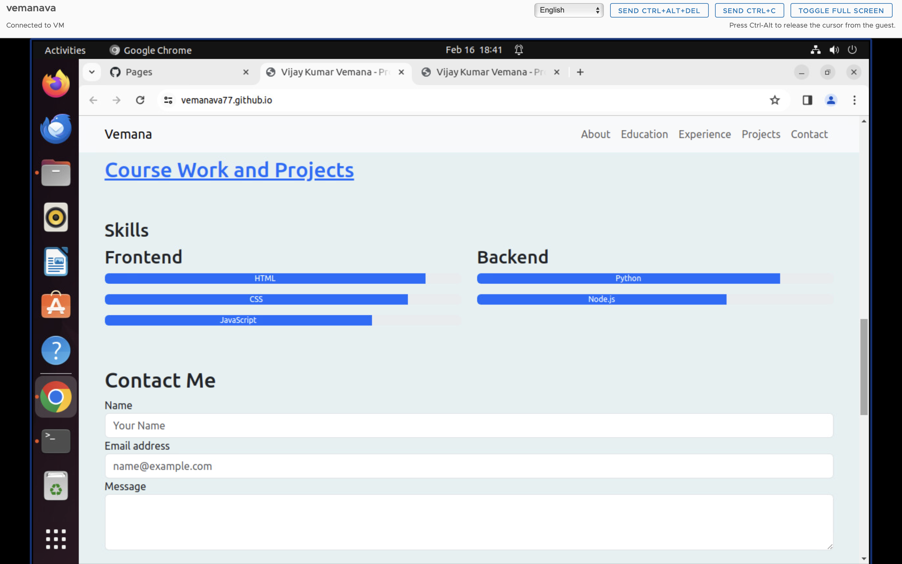

# WAPH-Web Application Programming and Hacking
## Instructor: Dr. Phu Phung

# Individual Project 1
## Front-end Web Development with a Professional Profile Website on github.io cloud service

## Overview

In this project,we expanded the front-end web development skills by developing a Professional Profile Website and deploying it on `github.io` cloud service. We have worked with CSS frameworks like Bootstrap and also java script frame works like Jquery and React .You can find all the code and files realted to this project here .

[https://github.com/vemanava77/vemanava77.github.io](https://github.com/vemanava77/vemanava77.github.io)

### General requirements :

Let's start from the first as you can seen in the Navbar and Details image you will find Navbar which will help you navigate you to differnet sections of  the webpage and it stays on the top even if you scoll down making the navigation easy . Below the navigtaion  you can see the personal Details and Headshot Image .The Githu  and Linked takes you to the those profiles . As you can see a message below Welcome to my home Page . This is enabled by cookies i.e when you visit the for the first time you get Welcome message but if you are a old user then you will see a welcome back message . And the Page is completly mobile responsive as you can see below.


Lets see how we were able to achieve these first we need to link bootstrap CDN so that we can use those classes
which can be achived by add the below lines of code to our head tag in index.html file

```
<link href="https://cdn.jsdelivr.net/npm/bootstrap@5.3.2/dist/css/bootstrap.min.css" 
    rel="stylesheet"
    integrity="sha384-T3c6CoIi6uLrA9TneNEoa7RxnatzjcDSCmG1MXxSR1GAsXEV/Dwwykc2MPK8M2HN" 
    crossorigin="anonymous">
<script src="https://cdn.jsdelivr.net/npm/bootstrap@5.3.2/dist/js/bootstrap.bundle.min.js"
    integrity="sha384-C6RzsynM9kWDrMNeT87bh95OGNyZPhcTNXj1NW7RuBCsyN/o0jlpcV8Qyq46cDfL"
    crossorigin="anonymous"></script>
```

Now lets see how can we achieve the navbar 


```
<nav class="navbar navbar-expand-lg navbar-light bg-light sticky-top">
            <div class="container">
                <a class="navbar-brand" href="#">Vemana</a>
                <button class="navbar-toggler" type="button" data-bs-toggle="collapse" 
                data-bs-target="#navbarNav"
                    aria-controls="navbarNav" aria-expanded="false" 
                    aria-label="Toggle navigation">
                    <span class="navbar-toggler-icon"></span>
                </button>
                <div class="collapse navbar-collapse" id="navbarNav">
                    <ul class="navbar-nav ms-auto">
                        <li class="nav-item">
                            <a class="nav-link" href="#about">About</a>
                        </li>
                        <li class="nav-item">
                            <a class="nav-link" href="#Education">Education</a>
                        </li>
                        <li class="nav-item">
                            <a class="nav-link" href="#Experience">Experience</a>
                        </li>
                        <li class="nav-item">
                            <a class="nav-link" href="#projects">Projects</a>
                        </li>
                        <li class="nav-item">
                            <a class="nav-link" href="#contact">Contact</a>
                        </li>
                    </ul>
                </div>
            </div>
</nav>
```


the below code help to acheive details section


```
<section class="container py-5">
            <div class="row align-items-center">
                <div class="col-12 col-md-4">
                    
                </div>
                <div class="col-12 col-md-7">
                    <h1>Vijay Kumar Vemana</h1>
                    <p><a href="mailto:youremail@example.com">vemanava@mail.uc.edu</a></p>
                    <p><strong>(513) 413-8621</strong></p>
                    <p><a href="https://www.linkedin.com/in/vijaykumarvemana/">LinkedIn</a></p>
                    <p><a href="https://github.com/vemanava77">GitHub</a></p>
                    <p><a href="files/Resume.pdf" class="btn btn-primary"
                            download="VijayKumarVemana_Resume.pdf">Download Resume</a></p>
                </div>
            </div> 
</section>
```

And lets add a few custom styles along with the Bootstrap 


```
body {
            background-color: #e5f0f2;
        }
```


In order to achieve the welcome and welcome back messaage 
we need to create a cookie and then we can use it 


```
<section>   
        <!-- Cookie and Message-->
    <div class="container py-3">
        <div id="last-visit" class="alert" role="alert">
        </div>
    </div>
    <!-- Cookie-->
    <script>
        // Function to set a cookie
        function setCookie(cname, cvalue, exdays) {
            const d = new Date();
            d.setTime(d.getTime() + (exdays * 24 * 60 * 60 * 1000));
            let expires = "expires=" + d.toUTCString(); 
            document.cookie = cname + "=" + cvalue + ";" + expires + ";path=/";
            
        }

        // Function to get a cookie
        function getCookie(cname) {
            let name = cname + "=";
            let decodedCookie = decodeURIComponent(document.cookie);
            let ca = decodedCookie.split(';');
            for (let i = 0; i < ca.length; i++) {
                let c = ca[i];
                while (c.charAt(0) === ' ') {
                    c = c.substring(1);
                }
                if (c.indexOf(name) === 0) {
                    return c.substring(name.length, c.length);
                }
            }
            return "";
        }

        function checkCookie() {
            let lastVisit = getCookie("lastvisit");
            let message = document.getElementById('last-visit');
            if (lastVisit !== "") {
                message.className += " alert-info";
                message.innerHTML = `Welcome back! Your last visit was on ${lastVisit}.`;
            } else {
                message.className += " alert-success";
                message.innerHTML = "Welcome to my homepage!";
            }
            setCookie("lastvisit", new Date().toLocaleString(), 365);
        }
    </script>
</section>
```


you can see the folowing sections below of education and experinece 


We can achieve this with the below code 

```
 <section class="container py-5" id="about">
        <h3>About Me</h3>
        <div class="card">
            <div class="card-body">
                <p class="card-text">As an enthusiastic web developer, 
                passionate about building user-friendly websites
                    and
                    applications. Skilled in HTML, CSS, JavaScript, and 
                    its frameworks like react and always interested
                    in
                    continuously learning new technologies.</p>
            </div>
        </div>
    </section>
    <!-- Education Section  -->
    <section class="container py-5" id="Education">
                <h3>Education</h3>
                <div class="card ">
                    <div class="card-body">
                        <h4 class="card-title"> Masters of Science in
                         Information Technology - University of Cincinnati
                        </h4>
                        <p class="card-text">2023-2025</p>
                    </div>
                    <div class="card-body">
                        <h4 class="card-title"> Bachelors in Electrical 
                        and Electronics Engineering - VRSEC</h4>
                        <p class="card-text">2017-2021</p>
                    </div>
        </div>
    </section>
    <!-- Experince Section  -->
    <section class="container py-5" id="Experience">
        <div class="row">
            <div class="col-md">
                <h3>Experience</h3>
                <div class="card mb-3">
                    <div class="card-body">
                        <h4 class="card-title">Assitant System Engineer - 
                        TATA Consultnacy Services</h4>
                        <p class="card-text">2021 - 2023</p>
                    </div>
                </div>
            </div>
        </div>
    </section>
    <!-- Link to course Overvire Page -->
    <section class="container py-5" id="projects">
        <div class="row">
            <div class="col-md-6">
                <h2><a href="projects.html" 
                target="_blank">Course Work and Projects </a></h2>
            </div>
        </div>
    </section>

```




```
<section>
        <div class="container">
            <div class="row">
                <div class="col-md">
                    <h3>Skills</h3>
                </div>
                <div class="container">
                    <div class="row">
                        <div class="col-md-6">
                            <h3>Frontend</h3>
                            <div class="progress mb-3">
                                <div class="progress-bar" role="progressbar" style="width: 90%;" aria-valuenow="90"
                                    aria-valuemin="0" aria-valuemax="100">HTML</div>
                            </div>
                            <div class="progress mb-3">
                                <div class="progress-bar" role="progressbar" style="width: 85%;" aria-valuenow="85"
                                    aria-valuemin="0" aria-valuemax="100">CSS</div>
                            </div>
                            <div class="progress mb-3">
                                <div class="progress-bar" role="progressbar" style="width: 75%;" aria-valuenow="75"
                                    aria-valuemin="0" aria-valuemax="100">JavaScript</div>
                            </div>
                        </div>


                        <div class="col-md-6">
                            <h3>Backend</h3>
                            <div class="progress mb-3">
                                <div class="progress-bar" role="progressbar" style="width: 85%;" aria-valuenow="85"
                                    aria-valuemin="0" aria-valuemax="100">Python</div>
                            </div>

                            <div class="progress mb-3">
                                <div class="progress-bar" role="progressbar" style="width: 70%;" aria-valuenow="70"
                                    aria-valuemin="0" aria-valuemax="100">Node.js</div>
                            </div>

                        </div>
                    </div>
                </div>

            </div>

        </div>
        </div>
    </section>
    <footer class="container py-5" id="contact">
        <h2>Contact Me</h2>
        <form>
            <div class="form-group">
                <label for="nameInput">Name</label>
                <input type="text" class="form-control" id="nameInput" placeholder="Your Name">
            </div>
            <div class="form-group">
                <label for="emailInput">Email address</label>
                <input type="email" class="form-control" id="emailInput" placeholder="name@example.com">
            </div>
            <div class="form-group">
                <label for="messageTextarea">Message</label>
                <textarea class="form-control" id="messageTextarea" rows="3"></textarea>
            </div>
            <br>
            <button type="submit" class="btn btn-primary">Send</button>
        </form>
    </footer>

```


The course overview page and its styling can be achived using the above 
```
<!DOCTYPE html>
<html lang="en">
<head>
    <meta charset="UTF-8">
    <meta name="viewport" content="width=device-width, initial-scale=1.0">
    <title>Web Application Programming and Hacking Course</title>
    <link href="https://cdn.jsdelivr.net/npm/bootstrap@5.3.2/dist/css/bootstrap.min.css" rel="stylesheet" 
    integrity="sha384-T3c6CoIi6uLrA9TneNEoa7RxnatzjcDSCmG1MXxSR1GAsXEV/Dwwykc2MPK8M2HN" 
    crossorigin="anonymous">
    <script src="https://cdn.jsdelivr.net/npm/bootstrap@5.3.2/dist/js/bootstrap.bundle.min.js"
     integrity="sha384-C6RzsynM9kWDrMNeT87bh95OGNyZPhcTNXj1NW7RuBCsyN/o0jlpcV8Qyq46cDfL" 
     crossorigin="anonymous"></script>
    <style>
        body {
            background-color: #f0f2f5; 
        }
        .container, .accordion-item {
            background-color: #ffffff; 
            border-radius: 8px; 
            box-shadow: 0 4px 8px rgba(0, 0, 0, 0.1); 
            margin-bottom: 20px;
        }
        h2 {
            color: #007bff; 
            font-weight: bold;
            margin-bottom: 20px; 
        }
        .accordion-button:not(.collapsed) {
            color: #007bff; 
            background-color: #e7f1ff; 
        }
    </style>
</head>
<body>

    <div class="my-5 p-4">
      <h2>Web Application Programming and Hacking Course</h2>
    
    <div class="container my-5 p-3">
        
        <p>In this course, students will study basic web application development with front-end

            (HTML5, JavaScript, CSS) and back-end (PHP/MySQL). Web application vulnerabilities and 

            attacks will be introduced and explored with hands-on exercises on the range. Secure programming principles and
            
            practices will be introduced to avoid potential web application vulnerabilities and attacks</p>
    </div>


    <h3 class="mx-3">Hands-on Projects</h3>
    <div class="accordion accordion-flush my-5 p-4" id="accordionFlushExample">
        
        <div class="accordion-item">
            <h2 class="accordion-header" id="flush-headingProjects">
                <button class="accordion-button collapsed" type="button" data-bs-toggle="collapse" data-bs-target="#flush-collapseProject1" aria-expanded="false" aria-controls="flush-collapseProjects">
                    Lab -1
                </button>
            </h2>
            <div id="flush-collapseProject1" class="accordion-collapse collapse" aria-labelledby="flush-headingProjects" data-bs-parent="#accordionFlushExample">
                <div class="accordion-body">
                    <p><strong>Lab 1: Foundations of the Web</strong></p>
                    <p>In this lab we have done mainly two things. Firstly we got more deeper into HTTP protocol . 
                        Wireshark tool was used to analyse the request and response .And aslo requests were sent
                         from differnet places like from browser and terminal (using telnet) and observed the diffrences . 
                         In second part we have built very basic CGI (Common Gateway Interface ) ,we used C programming language to
                          built the CGIs and then we buitl basic OHP pages and then moved on to build web servers using PHP wheer we also sent data 
                        along with requests and observed how the web servers handled the data in wireshark. Can be found here <a href="https://github.com/vemanava77/waph-vemanava/tree/main/labs/lab1">here</a></p>
                </div>
            </div>
        </div>
        <div class="accordion-item">
          <h2 class="accordion-header" id="flush-headingProjects">
              <button class="accordion-button collapsed" type="button" data-bs-toggle="collapse" data-bs-target="#flush-collapseProject2" aria-expanded="false" aria-controls="flush-collapseProjects">
                  Lab -2
              </button>
          </h2>
          <div id="flush-collapseProject2" class="accordion-collapse collapse" aria-labelledby="flush-headingProjects" data-bs-parent="#accordionFlushExample">
              <div class="accordion-body">
                  <p><strong> Lab 2:Front-end Web Development</strong></p>
                  <p>In this lab we build our first HTML page and then add styles to our page using CSS using inline , 
                    internal, external methods and then we add javascript to our code using inline , internal and external ways .
                    And then we move onto sending
                     requests using AJAX and integrating Web API using and then fetch API to render the response of those API.Can be found here <a href="https://github.com/vemanava77/waph-vemanava/tree/main/labs/lab2">here</a></p>
              </div>
          </div>
      </div>
      <div class="accordion-item">
        <h2 class="accordion-header" id="flush-headingProjects">
            <button class="accordion-button collapsed" type="button" data-bs-toggle="collapse" data-bs-target="#flush-collapseProject3" aria-expanded="false" aria-controls="flush-collapseProjects">
                Hackathon 1 - Cross-site Scripting Attacks and Defenses
            </button>
        </h2>
        <div id="flush-collapseProject3" class="accordion-collapse collapse" aria-labelledby="flush-headingProjects" data-bs-parent="#accordionFlushExample">
            <div class="accordion-body">
                <p><strong>Hackathon 1 - Cross-site Scripting Attacks and Defenses</strong></p>
                <p>In this hackathon we got to do cross scripting attacks on multiple levels and we tried to exploit the server code and we tried to guess what might be the vulnerabilities that are enabling us to do the attacks . In the next task we tried to implement defences for the front end development prototype we built in lab2 and server code we used in lab2 .

                    This hackathon has two tasks with multiple sub-tasks with grade distribution all the files related to it are present
                    
                    <a href="https://github.com/vemanava77/waph-vemanava/tree/main/labs/lab3">here</a>
                    
                    and we have made code revison to the front end prototype which have done in previous lab which can be found 
                    
                    <a href="https://github.com/vemanava77/waph-vemanava/tree/main/labs/lab2">here</p>
            </div>
        </div>
    </div>
    </div>
    </div>
</body>
</html>
```

Now we need to integrate Joke API inorder to do that in Jquery we need to include that CDN in head once that is done we can send out a asynchrnous request to that API and once we get a response we need to render it if not throw a error . we need to send out the request every one min so we need to call that function using setInterval


we can achive the above by using the below code 

```
 <section class="container py-5" id="jokes">
        <h3>Funny Moment</h3>
        <div class="card">
            <div class="card-body">
                <p class="card-text" id="jokeSetup">Loading joke...</p>
                <p class="card-text" id="jokeDelivery"></p>
            </div>
        </div>
        <script>
            async function fetchJoke() {
                try {
                    const response = await fetch('https://v2.jokeapi.dev/joke/Any');
                    if (!response.ok) {
                        throw new Error(`HTTP error! status: ${response.status}`);
                    }
                    const data = await response.json();
                    if (data.error) {
                        document.getElementById('jokeSetup').innerText = 'Error fetching joke';
                        document.getElementById('jokeDelivery').innerText = '';
                        return;
                    }
                    document.getElementById('jokeSetup').innerText = data.setup || '';
    
                    if (data.delivery) {
                        document.getElementById('jokeDelivery').innerText = data.delivery;
                    } else {
                        document.getElementById('jokeDelivery').innerText = '';
                    }
                } catch (error) {
                    console.error('Error fetching joke:', error);
                    document.getElementById('jokeSetup').innerText = 'Failed to load joke';
                    document.getElementById('jokeDelivery').innerText = '';
                }
            }
    
            setInterval(fetchJoke, 60000);
    
            // Initial call to load a joke when the page loads
            fetchJoke();
        </script>
    </section>
```

Asd aslo you can see e button to toogle the email we use react to do that in order to use React in our HTMl we need to use react CDN . Once we have done that we redner the React functional components in our HTML page 


```

<div id="email"></div>
    <script type="text/babel">
            function EmailToggle() {
                const [shown, setShown] = React.useState(false);
                function toggleEmail() {
                setShown(!shown);
            }
                return (

                    <div className="container mt-3">
                        <button onClick={toggleEmail} className="btn btn-primary">
                            {shown ? 'Hide my email' : 'Show my email'}
                        </button>
                        {shown && <p className="mt-2"><a href="mailto:vemanava@mail.uc.edu" 
                            className="link-primary">vemanava@mail.uc.edu</a></p>}
                    </div>
                );
            }
            ReactDOM.render(<EmailToggle />, document.getElementById('email'));
    </script>
```
And we aslo need to babel to parse the JSX 

```
    <script src="https://unpkg.com/react@18/umd/react.production.min.js" crossorigin></script>
    <script src="https://unpkg.com/react-dom@18/umd/react-dom.production.min.js" crossorigin></script>
    <!-- Babel for JSX parsing -->
    <script src="https://unpkg.com/babel-standalone@6/babel.min.js"></script>
    <!-- jquery  -->
    <script src="https://ajax.googleapis.com/ajax/libs/jquery/3.6.0/jquery.min.js"></script>

```

We can toogle the mail using that button and you can see the analog and digital clock we used jquery


Which can be acived using the below code 

```
 <section>
        <div class="container my-5">
            <div class="card">
                <div class="card-body text-center">
                    <h5 class="card-title">Analog Clock</h5>
                    <canvas id="analog-clock" width="150" height="150" 
                    style="background-color:#999;"></canvas>
                </div>
            </div>
            <div id="digital-clock" class="text-center mt-3"></div>
        </div>
        <script src="https://waph-uc.github.io/clock.js"></script>
        <script>
            $(document).ready(function () {
                var canvas = $('#analog-clock')[0];
                var ctx = canvas.getContext("2d");
                var radius = canvas.height / 2;
                ctx.translate(radius, radius);
                radius *= 0.90;
                setInterval(drawClock, 1000);
    
                function drawClock() {
                    drawFace(ctx, radius);
                    drawNumbers(ctx, radius);
                    drawTime(ctx, radius);
                }
    
                function displayTime() {
                    $('#digital-clock').text("Current time: " + new Date().toLocaleTimeString());
                }
                setInterval(displayTime, 500);
            });
        </script>
    </section>
```


```
 <section>
        <div id="time"></div>
        <script type="text/babel">
            // React component
            function DateTimeDisplay() {
                const [date, setDate] = React.useState('');
                return (
                    <div id="date-time" className="text-center mt-5">
                        <div id="date" className="btn btn-primary" 
                        onClick={() => setDate(new Date().toString())}>
                            {date || "Click here to show date"}
                        </div>
                    </div>
                );
            }
            ReactDOM.render(<DateTimeDisplay />, document.getElementById('time'));
        </script>
    </section>
```


First we need to create weather API account and then we can get a API key and we can use that API key in our function to fetch url and render the response which we can get it done by below code 

```
<section>
        <div id="forecast-container" class="container my-5">
            <div class="card">
                <div class="card-body text-center">
                    <h2 class="card-title">Weather Dashboard</h2>
                    <div class="input-group mb-3">
                        <input type="text" id="cityInput" class="form-control" 
                        placeholder="Enter city" aria-label="City name" aria-describedby="searchButton">
                        <button class="btn btn-outline-primary" type="button" 
                        id="searchButton" onclick="fetchWeatherData()">Search</button>
                    </div>
                    <div class="forecast-output mt-4">
                        
                        <div id="temperatureInfo" class="h3"></div>
                        <div id="conditionSummary" class="h5"></div>
                        <div id="detailedForecast" 
                        class="d-flex flex-row justify-content-between flex-wrap"></div>
                    </div>
                </div>
            </div>
        </div>
        <script>
            async function fetchWeatherData() {
                const weatherApiKey = '0bc02c6fea908524f87b25cdd791b2b6';
                const cityName = document.getElementById('cityInput').value;
    
                if (!cityName) {
                    alert('Please enter a city name');
                    return;
                }
    
                const apiUrlCurrent = `https://api.openweathermap.org/data/2.5/weather?q=${cityName}&appid=${weatherApiKey}`;
                const apiUrlForecast = `https://api.openweathermap.org/data/2.5/forecast?q=${cityName}&appid=${weatherApiKey}`;
    
                try {
                    const responseCurrent = await fetch(apiUrlCurrent);
                    const dataCurrent = await responseCurrent.json();
                    renderCurrentWeather(dataCurrent);
                } catch (error) {
                    console.error('Error fetching current weather data:', error);
                    alert('Error fetching current weather data. Please try again.');
                }
    
                try {
                    const responseForecast = await fetch(apiUrlForecast);
                    const dataForecast = await responseForecast.json();
                    renderForecastData(dataForecast.list);
                } catch (error) {
                    console.error('Error fetching forecast data:', error);
                    alert('Error fetching forecast data. Please try again.');
                }
            }
    
            function renderCurrentWeather(weatherData) {
                const tempSection = document.getElementById('temperatureInfo');
                const conditionSection = document.getElementById('conditionSummary');
                const weatherIconDisplay = document.getElementById('forecastIcon');
                const forecastSection = document.getElementById('detailedForecast');
    
                // Clear previous content
                tempSection.innerHTML = '';
                conditionSection.innerHTML = '';
                forecastSection.innerHTML = '';
    
                if (weatherData.cod === '404') {
                    conditionSection.innerHTML = `<p>${weatherData.message}</p>`;
                } else {
                    const locationName = weatherData.name;
                    const tempCelsius = Math.round(weatherData.main.temp - 273.15); // Convert to Celsius
                    const weatherDescription = weatherData.weather[0].description;
                    const weatherIconCode = weatherData.weather[0].icon;
                    const iconUrl = `https://openweathermap.org/img/wn/${weatherIconCode}@4x.png`;
    
                    tempSection.innerHTML = `<p>${tempCelsius}°C</p>`;
                    conditionSection.innerHTML = `<p>${locationName}</p><p>${weatherDescription}</p>`;
                    weatherIconDisplay.src = iconUrl;
                    weatherIconDisplay.alt = weatherDescription;
    
                    displayWeatherIcon();
                }
            }
    
            function renderForecastData(forecastData) {
                const forecastPanel = document.getElementById('detailedForecast');
                const upcomingHours = forecastData.slice(0, 8); // Display the next 24 hours (3-hour intervals)
    
                upcomingHours.forEach(item => {
                    const forecastTime = new Date(item.dt * 1000); // Convert timestamp to milliseconds
                    const forecastHour = forecastTime.getHours();
                    const forecastTemp = Math.round(item.main.temp - 273.15); // Convert to Celsius
                    const iconCode = item.weather[0].icon;
                    const iconImageUrl = `https://openweathermap.org/img/wn/${iconCode}.png`;
    
                    const forecastHTML = `
                        <div class="forecast-item">
                            <span>${forecastHour}:00</span>
                            
                            <span>${forecastTemp}°C</span>
                        </div>
                    `;
    
                    forecastPanel.innerHTML += forecastHTML;
                });
            }
    
            function displayWeatherIcon() {
                const iconElement = document.getElementById('forecastIcon');
                iconElement.style.display = 'block'; // Show the image
            }
        </script>
    </section>

```

All the above code is published to cloud we use github cloud itself so we navigate to pages in settings and we publish the code in that repo.
 ​
Now its all done we need to include a page tracker in order to do that we need to create a account in any analytics platform i used google analytics and i cteated a stream and i get a id and included the code to track the numeber of users 

```
<script>
        window.dataLayer = window.dataLayer || [];
        function gtag() { dataLayer.push(arguments); }
        gtag('js', new Date());

        gtag('config', 'G-HZ5E8FJVKZ');
    </script>

```

and we can track the user in page as you can see 


